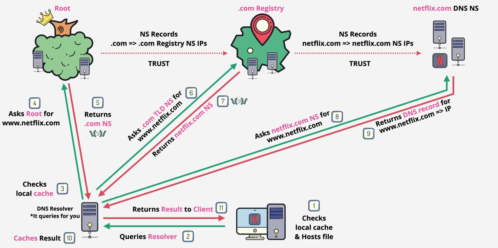

Les adresses IP : 
Les classes d'adresses IP (A, B, C, D, E) se distinguent par la plage d'adresses qu'elles couvrent et leur usage spécifique

| Classe | Adresse de début   | Adresse de fin     | Usages                      |
|--------|--------------------|--------------------|---------------------------- |
| A      | 0.0.0.0            | 127.255.255.255    | Grandes organisations       |
| B      | 128.0.0.0          | 191.255.255.255    | Réseaux de taille moyenne   |
| C      | 192.0.0.0          | 223.255.255.255    | Petits réseaux/particuliers |
| D      | 224.0.0.0          | 239.255.255.255    | Multicast                   |
| E      | 240.0.0.0          | 255.255.255.255    | Expérimentale               |

<div style="text-align: center;">
<table>
  <thead>
    <tr style="background-color: blue; color: black;">
      <th>Classe</th>
      <th>Adresse de début</th>
      <th>Adresse de fin</th>
      <th>Usages</th>
    </tr>
  </thead>
  <tbody>
    <tr>
      <td>A</td>
      <td>1.0.0.0</td>
      <td>126.255.255.255</td>
      <td>Grandes organisations</td>
    </tr>
    <tr>
      <td>B</td>
      <td>128.0.0.0</td>
      <td>191.255.255.255</td>
      <td>Réseaux de taille moyenne</td>
    </tr>
    <tr>
      <td>C</td>
      <td>192.0.0.0</td>
      <td>223.255.255.255</td>
      <td>Petits réseaux/particuliers</td>
    </tr>
    <tr>
      <td>D</td>
      <td>224.0.0.0</td>
      <td>239.255.255.255</td>
      <td>Multicast</td>
    </tr>
    <tr>
      <td>E</td>
      <td>240.0.0.0</td>
      <td>255.255.255.255</td>
      <td>Expérimentale</td>
    </tr>
  </tbody>
</table>
</div>

Cette représentation en classe est en train d'être remplacée par la notation **CIDR** Classless interDomain Routing.

#### Une adresse IP CIDR:
Une adresse IP CIDR ajoute une valeur de suffixe indiquant le nombre de bits de préfixe d'adresse réseau à une adresse IP normale.

Par exemple, ,192.168.1.224/27 est une adresse CIDR IPv4 où les 27 premiers bits correspondent à l'adresse réseau.

- L'adresse IP en binaire :
```
11000000.10101000.00000001.11100000 ==> 192.168.1.224
```

- Le masque réseau de /27 en binaire est représenté par 27 bits à 1 suivis de 5 bits à 0 
```
11111111.11111111.11111111.11100000 ==> 255.255.255.224
```
- Nombre d'adresses IP = 2 ^ (32 - CIDR) ==> 2^(32-27) = 32 adresse IP.

- L'adresse de début: correspond à l'adresse réseau ==> 192.168.1.224

- L'adresse de fin: correspond à l'adresse de diffusion ou tous les bits après les 27 premiers sont mis à 1 :

```
11000000.10101000.00000001.11111111 ==> 192.168.1.255
```
- Les adresses assignagles sont : 

```
192.168.1.1 à 192.168.1.254
```
Les ports réseau vont de 0 à 65535. Les premiers, de 0 à 1023, sont réservés.
Pour affciher les détails des ports réservés : 
```
cat /etc/services
```
#### Système de nom de domaine (DNS)
Domain Name System (DNS) permet de convertir les noms de domaine en adresses IP.

La figure ci dessous montre le chemin standard d'une requête DNS: 

 <p align="center">

</p>
<p align="center">
chemin d'une requête DNS
</p>

- **Le Récurseur DNS (DNS Resolver) :** c'est un serveur qui répond aux requêtes de noms de domaine en interrogeant d'autres serveurs DNS. Il agit à la fois comme un client lorsqu'il envoie des requêtes et comme un serveur lorsqu'il répond aux clients locaux.

- **Le serveur de noms racine :** est responsable de la zone racine.  Il indique quel serveur de noms de domaine de premier niveau (Top-Level Domain TLD) consulter pour trouver l'adresse IP correspondante.

- **Le serveur de noms TLD :** stocke les informations sur les serveurs de noms autorisés pour les domaines de deuxième niveau qui partagent le même suffixe. Lorsqu'une requête lui parvient, il indique au demandeur l'adresse du serveur de noms qui détient les informations exactes pour résoudre le nom de domaine.

- **Serveurs de noms faisant autorité :**  c' est un serveur qui répond d'une façon définitive aux requêtes DNS relatives à ce qui contient comme  "enregistrements DNS" pour une zone DNS spécifique.

## Gestion des hôtes sans serveur DNS
S'il n'y a pas de serveur DNS, il est possible de configurer en local le fichier /etc/hosts, qui contient la liste des noms d'hôtes et de leurs adresses IP correspondantes.

| **Type de routage**     |**Description**                                                          |   
|------------------------ |-------------------------------------------------------------------------|
| **Routage implicite**   | Le système utilise une route par défaut pour le trafic.                 |
| **Routage statique**    | Routes configurées manuellement par un administrateur.                  |
| **Routage dynamique**   | Repose sur des protocoles de routage (comme OSPF, RIP, BGP) qui ajustent|
|                         | automatiquement les routes en fonction des changements dans le réseau.  |


Afficher les paramètres des périphériques réseaux

```
ip addr    ou  ip address
```

Affichez les informations de la carte eth0,

```
ip addr show dev eth0
```

Pour afficher toutes les informations relatives au protocole IPv4 pour tous les périphériques réseaux

```
ip -4 a
```
Pour afficher toutes les informations relatives au protocole IPv6 pour tous les périphériques réseaux
```
ip -6 a
```
Affichez les informations de la carte eth0, en filtrant celles qui sont propres à l’IPV4

```
ip -4 addr show eth0
```

Pour supprimer une adresse IP d'une interface réseau avec la comande ip  : 
```
ip addr del <adresse_ip>/<masque> dev <interface>     where  <adresse_ip>/<masque> is the CIDR
```
Pour ajouter une adresse IP à une carte réseau : 
```
ip addr add <adresse_ip>/<masque> dev <interface>     where  <adresse_ip>/<masque> is the CIDR
```

Pour désactiver l'interface réseau :

```
sudo ip link set down <interface>
```

Pour vérifier l'état de l'interface réseau : 
```
ip link show enp5s0
```
Si l'interface est active l'indicateur d'état est UP, sinon il est DOWN

Pour activer l'interface réseau :
```
sudo ip link set up <interface>
```

Pour voir si un serveur est connecté, il est possible d'utiliser la commande ping qui se pase sur le protocole _ICMP_: 
```
ping google.fr
```

Deux manières existe pour attribuer une adresse IP à un appareil : 
  - manière statique : les adresses IP static sont attribués manuellement.
  - manière dynamique: les adresses IP dynamiques sont attribuées automatiquement par un routeur ou un serveur DHCP (Dynamic Host Configuration Protocol)  

La commande qui permet de demander au retour ou au serveur dhcp une adresse IP : 
```
sudo dhclient <interface>
```

Il est possible de définir dans le fichier _/etc/resolv.conf_ les serveurs DNS auxquels notre appareil peut accéder pour demander la résolution IP/Domain.
Les serveurs DNS sont ajoutés par défaut dans nos fichiers de configurations. 
Si nous nous connectons à un routeur, le DNS défini par défaut est le routeur lui-même 
Pour ajouter un serveur DNs simple, dans le fichier /etc/resolv.conf nous ajoutons la  structure : 
```
nameserver adresse_ip.
```
Pour effectuer une résolution de nom de domaine (DNS lookup) : 
```
host google.fr
```

Pour afficher le nom d'hôte de la machine :
```
hostname
```

Pour  définir le nom d'hôte de la machine dans la session actuelle :
```
sudo hostname <nouveau_nom>
```
Pour modifier le nom d'hôte de manière permanente, il est recommandé de modifier à la fois les _fichiers /etc/hostname_ et _/etc/hosts_.
- /etc/hostname : Ce fichier contient le nom d'hôte du système. Il est utilisé lors du démarrage du système pour définir le nom d'hôte.
- /etc/hosts : Ce fichier associe le nom d'hôte à l'adresse IP locale (généralement 127.0.1.1 ou 127.0.0.1)

Il est possible de modifier définitivement le nom d'hôte à l'aide de la commande : 
```
sudo hostnamectl set-hostname <nouveau_nom> 
```
## Routage
